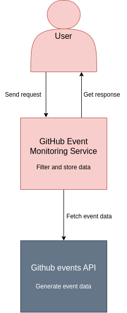

# GitHub Event Fetcher

This project is a FastAPI-based application that fetches events from the GitHub API, processes them, and provides endpoints to query the data. The application uses an asynchronous task to periodically fetch events from the GitHub API every 10 seconds.

## Dependencies

 - uv

Install **uv** tool with command: ```pipx install uv```

## How to Run the Solution

1. **Clone the Repository**:
    ```bash
    git clone <repository-url>
    cd datamole
    ```

2. **Install Dependencies**:
    Make sure you have Python 3.12+ installed. Then, create a virtual environment and install the required dependencies:
    ```bash
    uv venv
    uv sync
    source .venv/bin/activate
    ```

3. **Run the Application**:
    Start the FastAPI application using `uvicorn`:
    ```bash
    uvicorn datamole.app:app --reload
    ```

4. **Access the API**:
    Open your browser or use a tool like `curl` or Postman to access the API at:
    ```
    http://127.0.0.1:8000
    ```

    You can also view the interactive API documentation at:
    ```
    http://127.0.0.1:8000/docs
    ```

## Endpoints

1. **`GET /average`**:
    - **Description**: Calculates the average time between pull request events for a given repository.
    - **Parameters**:
      - `repository` (query parameter): The name of the repository.
    - **Response**: Returns the average time in seconds.

2. **`GET /total`**:
    - **Description**: Returns the total number of events of each type within a given time offset.
    - **Parameters**:
      - `offset` (query parameter): The time offset in minutes.
    - **Response**: Event types and their counts.

## C4 diagram

